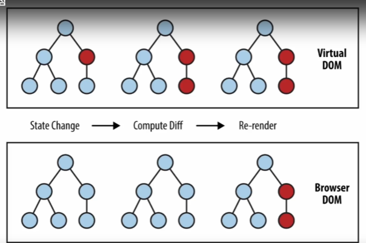

## 1. React란?
- 사용자 인터페이스를 만들기 위한 javascript UI 라이브러리 

- 프레임 워크 vs 라이브러리
    - 프레임 워크 : 제어 권한이 프레임 워크에 있음
    - 라이브러리 : 제어 권한이 개발자에게 있음

## 2. React 장점
1. 빠른 업데이트 & 렌더링 속도
    - 여기서 말하는 업데이트는 화면을 빠르게 전환(변화)하는 것
    - React는 이런 빠른 속도를 위해 virtual Dom을 사용함
    - virtual Dom (Document object model) : 하나의 웹페이지 요소를 담고 있는 가상의 돔
    - 화면이 업데이트 한다는 것은 돔이 업데이트가 된다는 것을 의미함
    - 수정할 곳

    

    - component-based : 